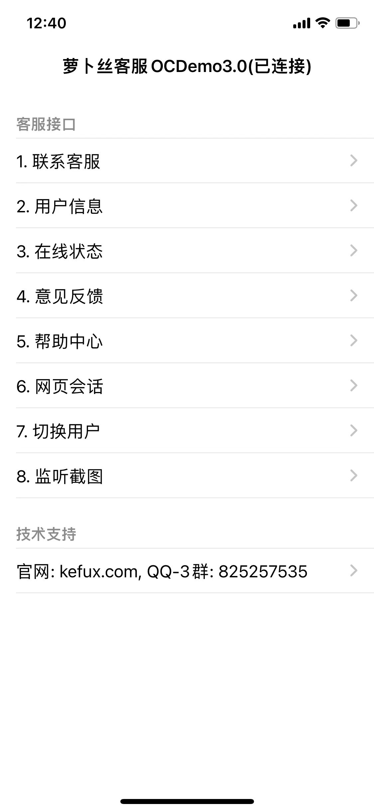
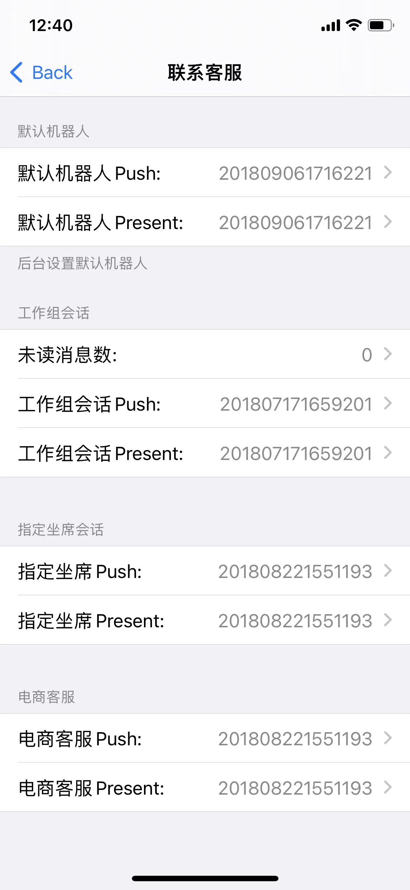
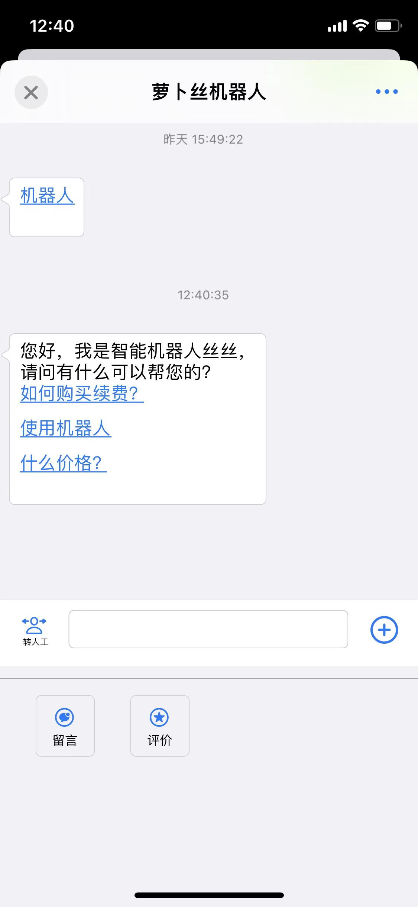
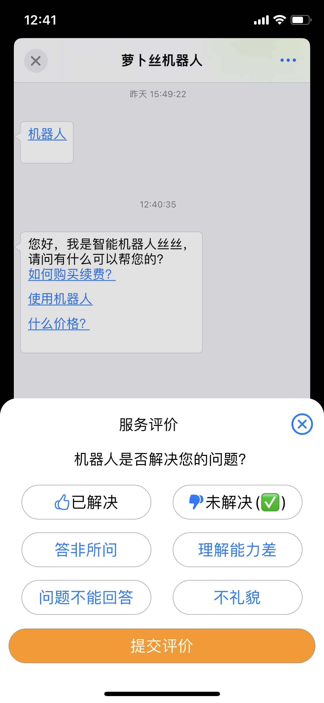
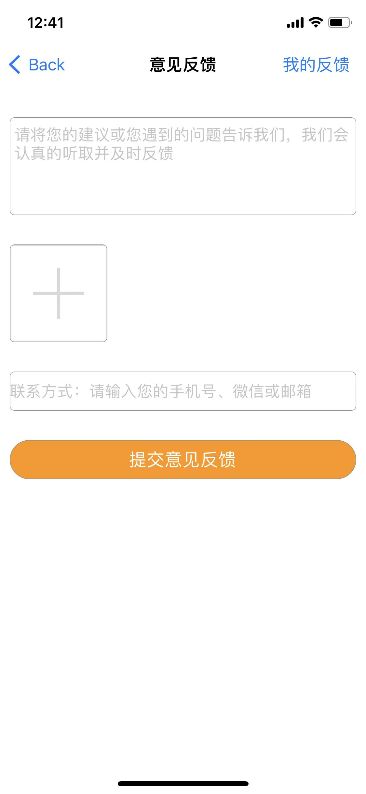
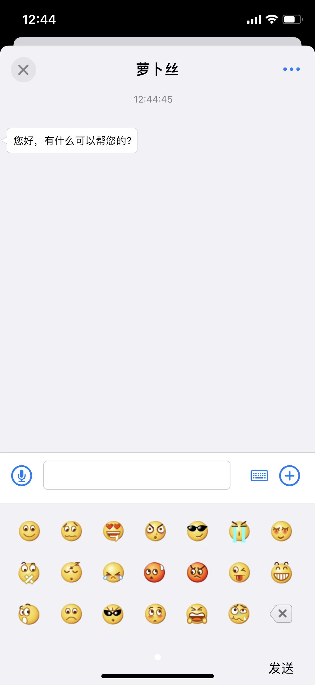
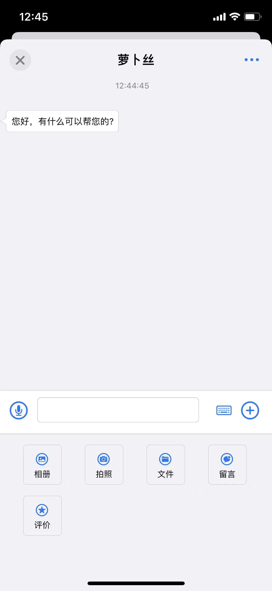
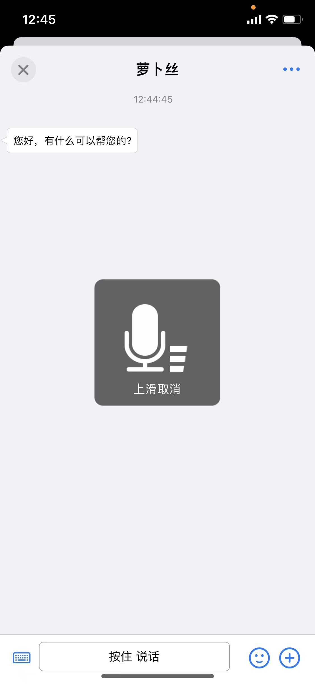

<!--
 * @Author: jackning 270580156@qq.com
 * @Date: 2023-09-05 16:33:36
 * @LastEditors: jackning 270580156@qq.com
 * @LastEditTime: 2024-10-21 16:07:46
 * @Description: bytedesk.com https://github.com/Bytedesk/bytedesk
 *   Please be aware of the BSL license restrictions before installing Bytedesk IM – 
 *  selling, reselling, or hosting Bytedesk IM as a service is a breach of the terms and automatically terminates your rights under the license. 
 *  仅支持企业内部员工自用，严禁私自用于销售、二次销售或者部署SaaS方式销售 
 *  Business Source License 1.1: https://github.com/Bytedesk/bytedesk/blob/main/LICENSE 
 *  contact: 270580156@qq.com 
 *  联系：270580156@qq.com
 * Copyright (c) 2024 by bytedesk.com, All Rights Reserved. 
-->
# 微语 Swift SDK

- [官网](https://www.weiyuai.cn/)
- [萝卜丝->请切换此分支](https://gitee.com/270580156/bytedesk-swift/tree/luobosi/)

## 语言

- [English](./README.md)
- [中文](./README.zh.md)

## 部分功能

- 微语官方技术支持
- 全部基于Swift开发，100%全部开源，支持自定义界面
- 支持人工客服
- 支持机器人
- 支持文字、图片、语音、表情
- 支持消息预知：对方正在输入
- 支持消息状态：送达、已读
- 支持消息撤回
- 支持发送商品信息
- 未读消息数查询接口
- 对接第三方账号系统
- 支持多用户切换

## 源码及Demo下载

- [Gitee](https://gitee.com/270580156/bytedesk-swift)
- [Github](https://github.com/Bytedesk/bytedesk-swift)

## 集成方式

建议: Xcode Version 14.3，最低兼容: iOS 13

### 方法 1. 本地集成

此方法适用于有自定义界面需求的开发者

- 下载源码，直接拖到自己项目中
- 选择项目，选中项目TARGET，选中 General，在 framework 中添加 bytedesk_swift.framework

### 方法 2. Swift Package Manager (SPM)

<!-- FIXME: 集成报错：
public headers ("include") directory path for 'bytedesk-oc' is invalid or not contained in the target -->
- 源地址1-gitee：<https://gitee.com/270580156/bytedesk-swift>
- 源地址2-github：<https://github.com/Bytedesk/bytedesk-swift>
- 国内用户建议使用源地址1
  
```bash
dependencies: [
    .package(url: "https://gitee.com/270580156/bytedesk-swift", .upToNextMajor(from: "3.0.0"))
]
或
dependencies: [
    .package(url: "https://github.com/Bytedesk/bytedesk-swift", .upToNextMajor(from: "3.0.0"))
]
```

### 3. Carthage

```bash
github 'bytedesk-swift/bytedesk-swift' ~> 3.0.0
```

### 预览

|                      image1                      |                       image2                       |                        image3                        |
| :----------------------------------------------: | :------------------------------------------------: | :--------------------------------------------------: |
|  |   |    |
|   |  |  |
|   |  |  |

<!-- ### 参考步骤 -->

<!-- -  
- 此处输入源地址：
- 加载中：
- 点击Add Package：
- 此处查看，如图为添加成功：
- 如果没有bytedesk-oc，则需要手动添加：
- 添加成功之后，便可以在源文件中引用： -->
<!-- #### 如果加载失败，建议重置 -->
<!-- -  -->

## 对话SDK

| Project     | Description           | Forks          | Stars             |
|-------------|-----------------------|----------------|-------------------|
| [iOS-swift](https://github.com/bytedesk/bytedesk-swift) | iOS swift  |  |                  |
| [Android](https://github.com/bytedesk/bytedesk-android) | Android |  |   |
| [Flutter](https://github.com/bytedesk/bytedesk-flutter) | Flutter | |  |
| [React](https://github.com/bytedesk/bytedesk-react) | React |  |  |
| [UniApp](https://github.com/bytedesk/bytedesk-uniapp) | Uniapp |  |  |
| [Web/Vue](https://github.com/bytedesk/bytedesk-web) | Web/Vue |  |  |

## 客户端

- [Windows](https://www.weiyuai.cn/download.html)
- [Mac](https://www.weiyuai.cn/download.html)
- [Linux](https://www.weiyuai.cn/download.html)
- [Android](https://www.weiyuai.cn/download.html)
- [IOS](https://www.weiyuai.cn/download.html)

## 技术栈

<!-- - [sofaboot](https://github.com/sofastack/sofa-boot/blob/master/README_ZH.md) for im server 基于金融级云原生架构-->
- [spring boot-3.x for 后端](https://github.com/Bytedesk/bytedesk)
- [python for ai](https://github.com/Bytedesk/bytedesk-ai)
- [react for web前端](https://github.com/Bytedesk/bytedesk-react)
- [flutter for 移动客户端(ios&android)](https://github.com/Bytedesk/bytedesk-mobile)
- [electron for 桌面客户端(windows&mac&linux)](https://github.com/Bytedesk/bytedesk-desktop)

## 联系

- [Email](mailto:270580156@qq.com)
- [微信](./images/wechat.png)
